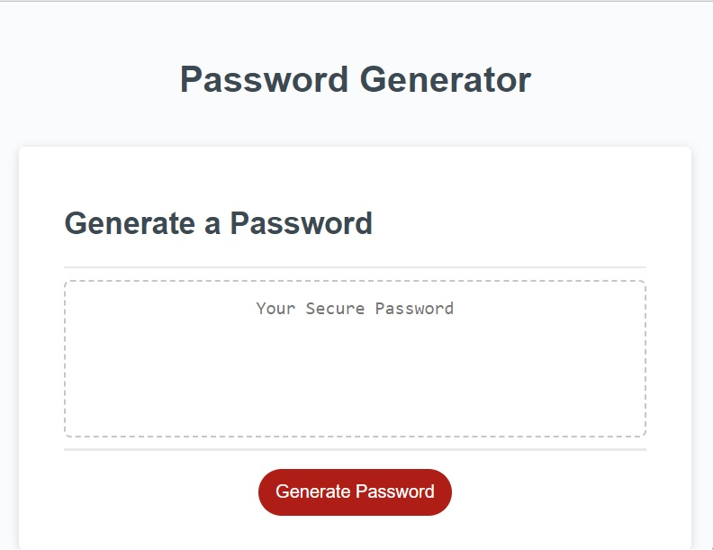
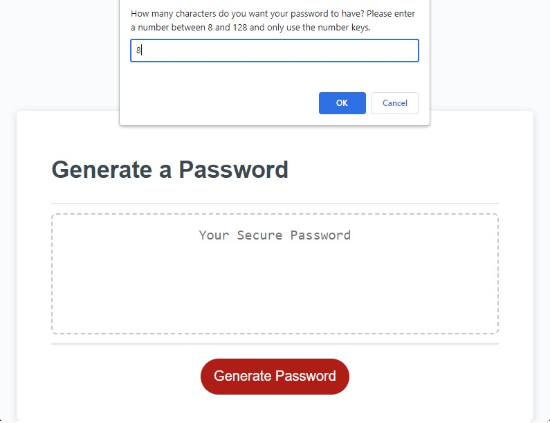
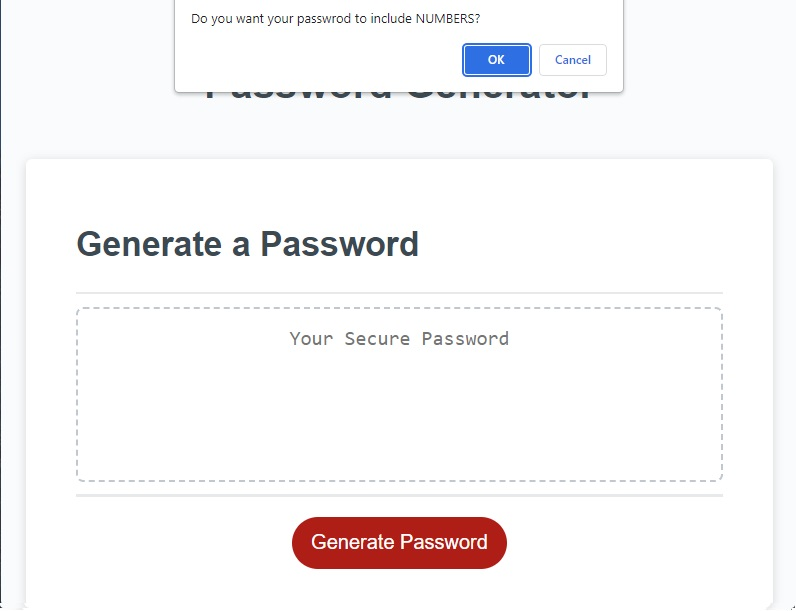
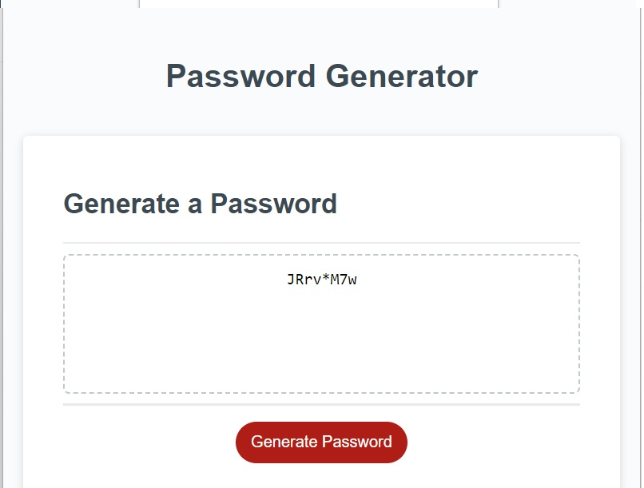

# Password-Generator

This is a web application that generates passwords based on user input. When the user clicks the **"Generate Password"** button, a prompt pops up to ask for the number of characters needed in the password. The user needs to enter a **number** between **8-128**. After confirming, the user is prompted to choose whether the password should contain numbers, upper case letters, lower case letters, and special characters. The user needs to accept **at least one** of the suggested characters. The web application then generates a password and presents it in the assigned box.

[Visit Password Generator Page](https://parisadarkhal.github.io/Password-Generator/)

## How to use

1. Click the "Generate Password" button.
2. Enter the number of characters you need in the password when prompted.
3. Choose whether you want the password to contain numbers, upper case letters, lower case letters, and special characters.
4. Confirm at least one of the suggested characters.
5. The web application will generate a password and present it in the assigned box.

---

## Example

Here's an example of how to use the Password Generator:

1. Click the "Generate Password" button.
   

2. Enter "8" when prompted for the number of characters needed in the password.
   

3. Choose **"OK"** for all the suggested characters.
   

4. The web application generates a password: "JRrv\*M7w"
5. The generated password is presented in the assigned box.
   

---

## Technologies used

This web application was built using **HTML, CSS,** and **JavaScript**.

## Credits

The Password Generator was developed by **Parisa Darkhal**.

## License

This project is licensed under the <u>MIT License</u>.
